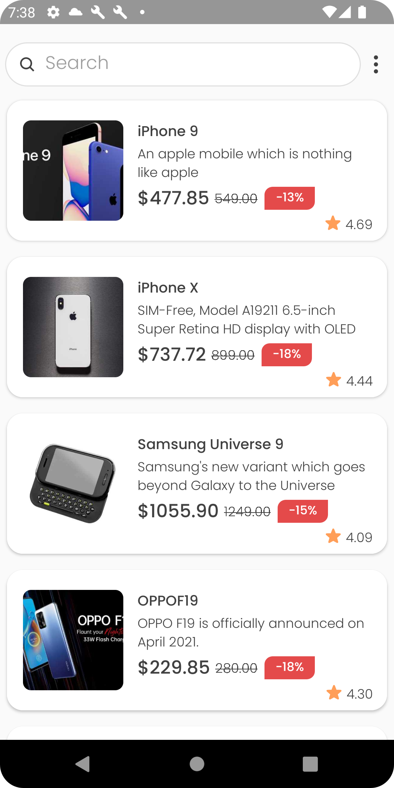
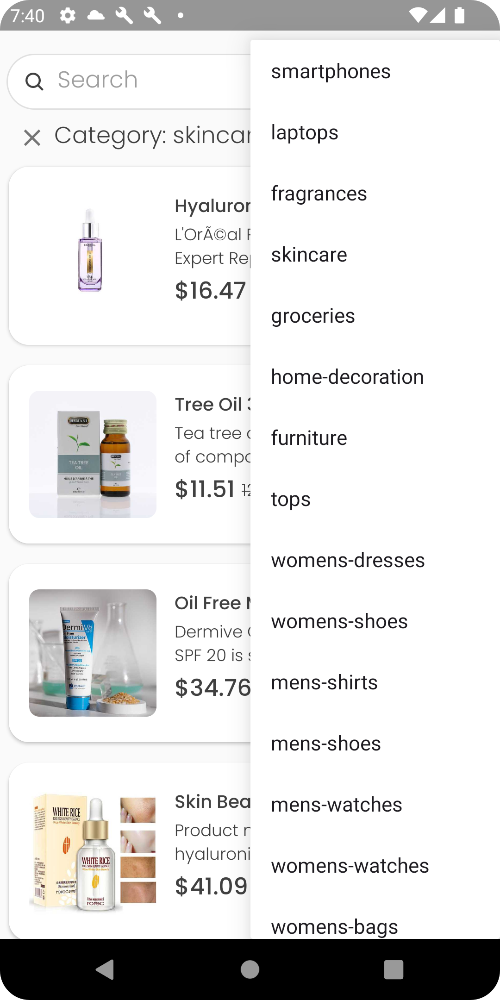
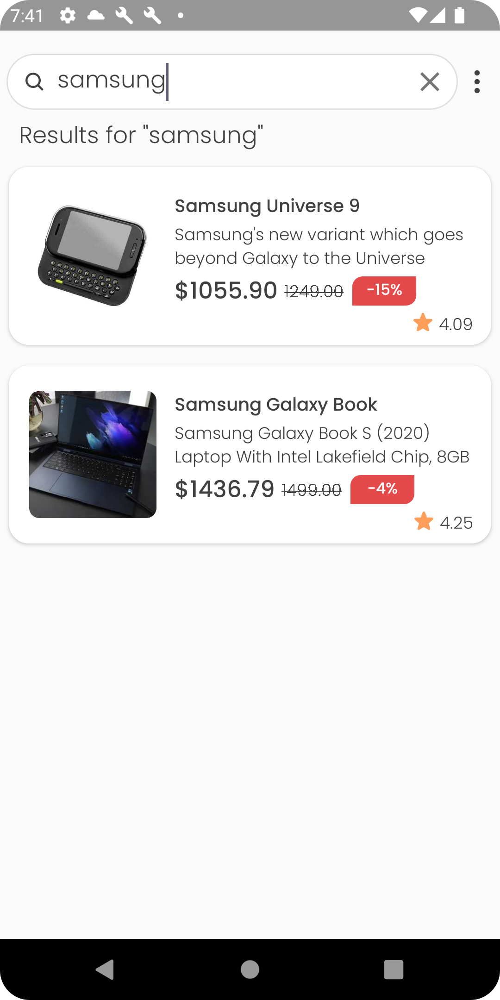

# Тестовое задание для стажёра Android 2024
# Приложение, отображающее вывод товаров

##### Автор: [Веселов Станислав](https://t.me/veselovml)

## Содержание

1. [Скриншоты](#скриншоты)
2. [Описание](#описание)
3. [Статус выполнения задач](#статус-выполнения-задач)
4. [Запуск](#запуск)
   
## Скриншоты

      

## Описание
### Технологии, используемые в проекте:

- **MVVM**
- **Hilt**
- **RxJava**
- **Retrofit**
- **Clean Architecture**

### Технологии:

- **Clean Architecture**
- **MVVM**
- **Hilt**
- **RxJava**
- **Retrofit**

## Статус выполнения задач

| Задание                                                                  | Готовность |
|--------------------------------------------------------------------------|------------|
| Основное задание                                                         | Готово     |
| Отображение дополнительных полей                                         | Готово     |
| Переход на экран товара                                                  | Готово     |
| Поиск                                                                    | Готово     |
| Сортировка по категориям                                                 | Готово     |

## Запуск

1. Найти последний [релиз](https://github.com/tower0000/vk-internship-task-android-2024/releases/tag/1.0.0).
2. Скачать `.apk` файл на андроид устройство.
3. Открыть загруженный файл и следовать инструкциям, чтобы установить приложение.
